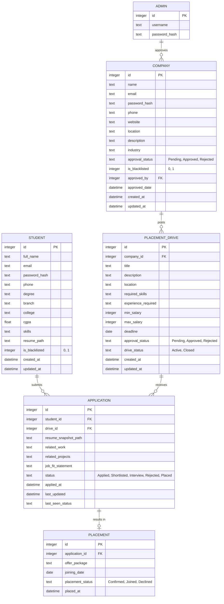

# Placement Portal EER Diagram

This diagram represents the Enhanced Entity-Relationship model for the Placement Portal Application.

## Key Relationships
- **Admin → Company**: One administrator can approve/manage multiple company registrations.
- **Company → PlacementDrive**: Each company can post multiple job opportunities (drives).
- **Student → Application**: A student can apply to multiple placement drives.
- **PlacementDrive → Application**: A single drive can receive applications from multiple students.
- **Application → Placement**: If an application is successful (status 'Placed'), it generates a single placement record (1:1 relationship).

## Integrity Constraints
- **Foreign Keys**: All relationships are enforced via foreign keys with `ON DELETE CASCADE` or `SET NULL` as appropriate.
- **Status Checks**: Fields like `approval_status`, [drive_status](file:///c:/Users/Tanaya/Desktop/24f2002943/24F2002943_root/app.py#905-941), and [application_status](file:///c:/Users/Tanaya/Desktop/24f2002943/24F2002943_root/app.py#943-998) have explicit `CHECK` constraints to ensure data validity.
- **Uniqueness**: `student_id` and `drive_id` combination in the `Application` table is unique to prevent duplicate applications.
